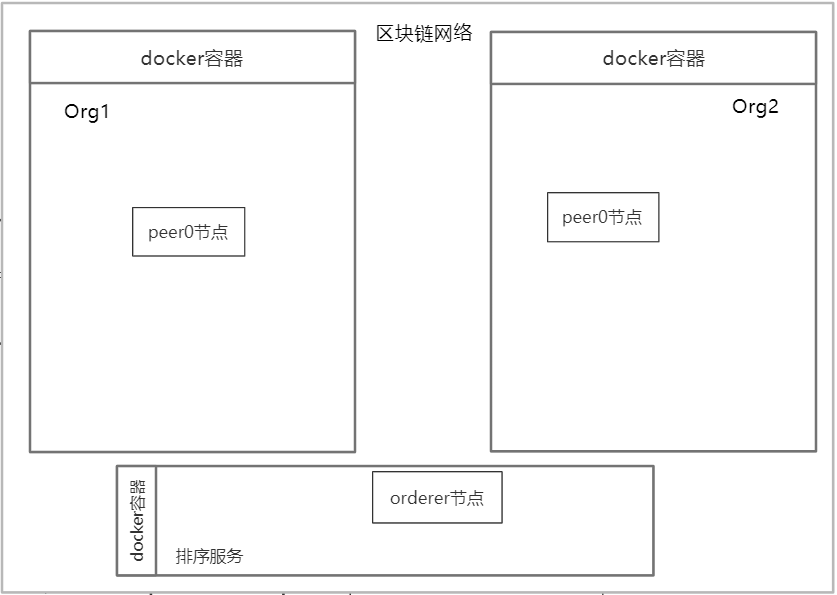

### 1. 代码结构
后端代码包括，实现业务逻辑的springboot项目：trace121模块和trace192模块；部署在区块链中的智能合约文件：chaincode目录下的fabmedia模块和fabtrace模块。

```java
back-end/
├── README.md
├── trace121			//项目表示层代码，接收前端发送过来的请求
│   ├── HELP.md
│   ├── nohupstart.sh	//后台运行脚本
│   ├── pom.xml			//maven项目对象工程文件
│   ├── shutdown.sh		//项目关闭脚本
│   └── src
│       ├── main
│       │   ├── java
│       │   │   └── com
│       │   │       └── trace
│       │   │           └── trace
│       │   │               ├── config
│       │   │               │   └── GrpcConfig.java
│       │   │               ├── controller
│       │   │               │   ├── ChartsController.java
│       │   │               │   ├── InfoController.java
│       │   │               │   ├── ManagerController.java
│       │   │               │   ├── MediaController.java
│       │   │               │   └── TraceController.java
│       │   │               └── Trace121Application.java
│       │   ├── proto
│       │   │   └── SearchService.proto
│       │   └── resources
│       │       └── application.yml
│       └── test
├── trace192
│   ├── nohupstart.sh
│   ├── pom.xml
│   ├── shutdown.sh
│   └── src
│       ├── main
│       │   ├── java
│       │   │   └── com
│       │   │       └── trace
│       │   │           └── trace
│       │   │               ├── config
│       │   │               │   ├── MongoConfig.java
│       │   │               │   ├── RedisConfig.java
│       │   │               │   └── RedisIndexConfig.java
│       │   │               ├── controller
│       │   │               │   └── SaveMediaController.java
│       │   │               ├── dao
│       │   │               │   ├── ChartsMongoDao.java
│       │   │               │   ├── ChartsRedisDao.java
│       │   │               │   ├── CompetRedisDao.java
│       │   │               │   ├── FabricDao.java
│       │   │               │   ├── MongoDao.java
│       │   │               │   ├── ProductRedisDao.java
│       │   │               │   ├── RedisDao.java
│       │   │               │   └── TraceRedisDao.java
│       │   │               ├── entity
│       │   │               │   ├── AgeOrSexDistributionData.java
│       │   │               │   ├── AllCompetinfo.java
│       │   │               │   ├── AllInfo.java
│       │   │               │   ├── Comment.java
│       │   │               │   ├── Comment_score.java
│       │   │               │   ├── CompanyInfo.java
│       │   │               │   ├── Compet_geo.java
│       │   │               │   ├── Compet.java
│       │   │               │   ├── Detail.java
│       │   │               │   ├── Graph.java
│       │   │               │   ├── JDdetail.java
│       │   │               │   ├── ProvinceIndexData.java
│       │   │               │   ├── Query.java
│       │   │               │   ├── Relate.java
│       │   │               │   ├── RelateSearchData.java
│       │   │               │   └── S3dScore.java
│       │   │               ├── mapper
│       │   │               │   ├── ChartsMapper.java
│       │   │               │   ├── CompetMapper.java
│       │   │               │   ├── DetailMapper.java
│       │   │               │   └── QueryMapper.java
│       │   │               ├── pojo
│       │   │               │   ├── AgeOrSexDistribution.java
│       │   │               │   ├── FabMediaInfo.java
│       │   │               │   ├── ProcedureInfo.java
│       │   │               │   ├── ProcessInfo.java
│       │   │               │   ├── ProvinceIndex.java
│       │   │               │   ├── RelateSearch.java
│       │   │               │   ├── TraceInfo.java
│       │   │               │   └── TraceManagerInfo.java
│       │   │               ├── service
│       │   │               │   ├── ManageProducts.java
│       │   │               │   ├── ManagerServiceImpl.java
│       │   │               │   ├── SearchCharts.java
│       │   │               │   ├── SearchChartsServiceImpl.java
│       │   │               │   ├── SearchCompet.java
│       │   │               │   ├── SearchGraph.java
│       │   │               │   ├── SearchProduct.java
│       │   │               │   ├── SearchServiceImpl.java
│       │   │               │   ├── SearchTrace.java
│       │   │               │   └── SearchTraceServiceImpl.java
│       │   │               ├── Trace192Application.java
│       │   │               └── util
│       │   │                   ├── CreateJson.java
│       │   │                   ├── CreateTraceCode.java
│       │   │                   ├── FabricUtil.java
│       │   │                   ├── FileUtil.java
│       │   │                   ├── JedisUtil.java
│       │   │                   ├── QRCodeUtil.java
│       │   │                   └── SaveUtil.java
│       │   ├── proto
│       │   │   └── SearchService.proto
│       │   └── resources
│       │       ├── application-dev.yml
│       │       ├── application-prod.yml
│       │       ├── application.yml
│       │       ├── fabric.properties
│       │       ├── log4j.properties
│       │       ├── mapper
│       │       │   ├── ChartsMapper.xml
│       │       │   ├── CompetMapper.xml
│       │       │   ├── DetailMapper.xml
│       │       │   └── QueryMapper.xml
│       │       └── redis.properties
│       └── test
└── Trace-BackEnd.md

```

### 2. 环境部署

#### 2.1 环境依赖
后端项目部署于Linux服务器上，其中trace121模块位于121.46.19.26主机，该主机具备公网内的联通性；trace192模块位于内网主机上，可被121主机访问到。
环境依赖包括：
| 名称 | 版本号 | 官网      |
| ---- | ------ | ------------------------ |
|Java SE Development Kit(JDK)  | 1.8.0  | https://www.oracle.com/java/technologies/javase/javase-jdk8-downloads.html |
|Apache Maven Project|3.6.3|https://maven.apache.org/download.cgi|
|Redis|6.0.10|https://redis.io/download|
|mongoDB|3.4.24|https://www.mongodb.com/try/download/community|
|MySQL|5.7.33|https://dev.mysql.com/downloads/mysql/|
#### 2.2 项目启动
分别在`trace121`和`trace192`目录下使用`mvn compile`指令下载依赖并编译源码，而后分别运行`sh nohupstart.sh`脚本启动项目。
#### 2.3 项目关闭
分别在`trace121`和`trace192`目录下运行`sh shutdown.sh`脚本停止项目。

### 3. 区块链环境部署
我们使用的区块链平台是Hyperledger Fabric，目前搭建出的架构包括两个组织Org1、Org2和一个排序服务，三者各拥有一个节点。Org1模拟第三方认证机构，即本团队，Org2模拟加盟企业。具体结构可见示意图，[区块链网络.png](README.assets/区块链网络.png)




具体部署过程如下：
#### 3.1 环境准备
docker，版本：20.10.3

docker-compose，版本：1.27.4

相关docker镜像，包括Hyperledger Fabric项目下的：
|名称|版本|
|----|----|
|fabric-javaenv|2.2.0|
|fabric-tools|2.2.0|
|fabric-peer|2.2.0|
|fabric-orderer|2.2.0|
|fabric-ccenv|2.2.0|
|fabric-baseos|2.2.0|
|fabric-ca|1.4.7|
和状态数据库
|名称|版本|
|----|----|
|couchdb|3.1.1|

Hyperledger Fabric所需二进制文件，放置在`bin`目录下，包括：
|名称|版本|
|----|----|
|configtxgen|2.2.0|
|configtxlator|2.2.0|
|cryptogen|2.2.0|
|discover|2.2.0|
|idemixgen|2.2.0|
|orderer|2.2.0|
|peer|2.2.0|
|fabric-ca-client|1.4.7|
|fabric-ca-server|1.4.7|
为便于快速部署，同时我们也准备好Hyperledger Fabric官方提供的测试网络相关文件，包括：https://github.com/hyperledger/fabric-samples/tree/master/test-network 目录下所有文件，即整个test-network目录。
#### 3.2 初始化配置
假定我们工作空间的路径为`workspace`，则上一步中所提到的`bin`目录和`test-network`目录，以及最开始提到的`blockchain`目录下的`chaincode`目录和`config`目录都位于`workspace`目录下。至此，启动区块链网络所需的二进制文件位于`bin`目录下，配置文件位于`config`目录下，链码（智能合约）文件位于`chaincode`目录下，节点配置文件及简化过的启动脚本位于`test-network`目录下。
#### 3.3 启动网络
在`test-network`目录下依次运行：
```shell
sh network.sh up	# 启动网络，包含Org1、Org2、排序服务三个组织
sh network.sh createChannel -c mychannel	# 在三个组织启动名为mychannel的通道
sh network.sh deployCC -c mychannel -ccn fabmedia -ccp ../chaincode/fabmedia -ccl java -cci initLedger	# 部署fabmedia链码
sh network.sh deployCC -c mychannel -ccn fabtrace -ccp ../chaincode/fabtrace -ccl java -cci initLedger	# 部署fabtrace链码
```

### 4. 配置说明
以下列出的是spring项目分别在两台服务器上的配置情况。
#### 4.1 trace121配置
application.yml
```yaml
management:
  endpoint:
    shutdown:
      enabled: true			# 启动actuator（spring管理功能）的shutdown端点
  endpoints:
    web:
      exposure:
        include: "*"			# 启动actuator的其它所有端点
      base-path: /MyActuator	# 设置actuator服务的基本路径
  server:
    port: 12584			# 设置actuator服务监听的端口
    address: 127.0.0.1	# 设置端点可用的地址，此处表示仅可本地访问

server:
  port: 8511			# 设置springboot服务监听的端口

app-config:
  grpc-server-name: 222.200.184.74	# 设置grpc服务端的地址，结合端口定位到trace192模块的grpc服务器上
  grpc-server-port: 8289			# 设置grpc服务端的端口
  max-message-size: 1073741824		# 设置grpc通讯可传输的最大文件大小
```
#### 4.2 trace192配置
application.yml
```yaml
spring:
  profiles:
    active: prod  # 用于指定配置文件，dev用于开发环境，prod用于生产环境
```
由于开发环境与生产环境配置项一样，仅具体参数不同，因此这里只详细说明开发环境的配置文件。
application-prod.yml
```yaml
# 生产环境配置文件
management:
  endpoint:
    shutdown:
      enabled: true			# 启动actuator（spring管理功能）的shutdown端点
  endpoints:
    web:
      exposure:
        include: "*"			# 启动actuator的其它所有端点
      base-path: /MyActuator	# 设置actuator服务的基本路径
  server:
    port: 12583			# 设置actuator服务监听的端口
    address: 127.0.0.1	# 设置端点可用的地址，此处表示仅可本地访问

spring:
  datasource:			# 设置spring项目mysql的数据源
    username: root		# 设置用于连接mysql的用户名
    password: ******	# 设置用于连接mysql的密码
    url: jdbc:mysql://localhost:3306/trace?useUnicode=true&characterEncoding=UTF-8	# 设置连接mysql的url
    driver-class-name: com.mysql.cj.jdbc.Driver		# 设置mysql的连接驱动
    type: com.alibaba.druid.pool.DruidDataSource	# 设置druid连接池
  data:
    mongodb:	# 设置mongodb连接参数
      uri: mongodb://localhost:27017/trace?maxpoolsize=150&minpoolsize=3
  redis:				# 设置redis连接参数
    host: localhost		# 设置redis服务器地址
    port: 6579			# 设置redis服务器端口
    jedis:
      pool:
        min-idle: 5		# 设置jedis连接池最小空闲数
        max-idle: 100	# 设置jedis连接池最大空闲数
    password: ******	# 设置redis连接密码
  application:
    name: hello-grpc-server	# 设置springboot应用服务名称

grpc:
  port: 8289		# 指定grpc服务监听的端口号

server:
  port: 8290		# 指定springboot服务监听的端口号

mybatis:			# 指定mybatis映射文件的位置
  mapper-locations: classpath:mapper/*.xml
  type-aliases-package: com.trace.trace.entity

media:				# 指定媒体文件存储位置及其索引存放位置
  video:
    path: /data/st01/monitor_files
    database: 13
  picture:
    path: /data/st01/monitor_files
    database: 14

fabric:	#这一部分是连接区块链架构Hyperledger Fabric的相关配置
  system:
    host: localhost				# 指定fabric网关的地址
    port: 7054					# 指定fabric网关的端口
    user: appUser				# 指定连接fabric使用的一般用户
    wallet: /data/st01/wallet	# 指定连接区块链网络用户身份凭据的存放位置
    # 指定连接区块链网关属性文件所在位置
    properties: /data/st01/trace192/src/main/resources/fabric.properties
    # 指定连接区块链网关私钥文件所在位置
    ca-pem: /data/st01/myfabric/simple-fabric/test-network/organizations/peerOrganizations/org1.example.com/ca/ca.org1.example.com-cert.pem
    # fabric网络启动时生成的网络连接配置文件
    conpath: /data/st01/myfabric/simple-fabric/test-network/organizations/peerOrganizations/org1.example.com/connection-org1.yaml
```
### 5. 接口情况

| controller| 示例Url                                                      | 参数     | 返回值                                                     | 备注 |
| ------------------------- | ------------------------------------------------------------ | -------- | ---------------------------------------------------------- | ---- |
| /getPicture/{filename:.+} | http://121.46.19.26:8511/getPicture/01-20210130092923-13.jpg | 图片名称 | 直接返回HttpServletResponse，用\可以接收。 |      |
| /getVideo/{filename:.+} | http://121.46.19.26:8511/getVideo/01-20210130092923.mkv | 视频名称 | 直接返回HttpServletResponse，用\<video\> \<source src="url"\>\</video\>可以接收。 |firefox、chrome、edge测试通过，IE不行。目前测试过传输200m大小的视频|
| /getCompet/{regis_id} | http://121.46.19.26:8511/getCompet/440108400003939 、http://121.46.19.26:8511/getCompet/520102000400793 | 主公司的工商注册号 | 返回竞品模块的主公司基本信息、竞品公司基本信息和地理信息、主公司商品信息、竞品商品信息 ||
| /getCommodity/{query}/{page} | http://121.46.19.26:8511/getCommodity/糖果/1 | 查询商品的检索词、要获取的商品页的页码 | 返回对应的检索结果，即对应页码的20条商品的skuId、标题、商店、价格、京东连接url、图片url、评价、类别等||
|/getOrigin/{origin_id}|http://121.46.19.26:8511/getOrigin/16119701634150000|依据唯一溯源码查询溯源信息|json字符串，嵌套了两层内部类，见示例|暂时尚未与图片视频建立关联，待定。|
| /getGraphByKind/{kind} | http://121.46.19.26:8511/getGraphByKind/冷冻食品 | 某一领域的关键词 | 返回该领域中主要的相关食品品牌信息，用于知识图谱的展示。 ||
| /getGraphByBrand/{brand} | http://121.46.19.26:8511/getGraphByBrand/湾仔码头 | 某一品牌的名称 | 返回品牌在所属领域中的竞品信息，用于知识图谱的展示。 ||
|/addProcess||POST请求接收四个参数：id=123456 &name=hahaha &master=lalala &location=lalala|返回更改后的溯源信息字符串或是报错信息。和/getOrigin返回结果同格式，但picture字段为空||
|/addFirstProcess||POST请求，接收foodType:油辣椒酱-275g-辣椒酱，com:公司名称，processCount:步骤数，name:第一个process的名称，master:第一个process负责人的名称，location:第一个工序所在城市|同上||
|/addProcedure||POST请求接收三个参数：id=123456 &name=hahaha &master=lalala| 同上                                                         ||
|/getAllTraceInfo/{regis_id}/{product_name}/{page}|http://121.46.19.26:8511/getAllTraceInfo/440108400003939/原味八宝粥-370g-速食粥/1 （泰奇）http://121.46.19.26:8511/getAllTraceInfo/520102000400793/油辣椒酱-275g-辣椒酱/1|公司工商注册号regis_id、商品名称product_name、页码page| 返回总页码pageCount以及溯源列表信息（溯源码id、产品名称foodname、规格specification、分类category、最新流程latestProcess、时间time） ||
|/getFirstProcessInfo/{regis_id}|http://121.46.19.26:8511/getFirstProcessInfo/440108400003939 、http://121.46.19.26:8511/getFirstProcessInfo/520102000400793|公司工商注册号regis_id| 该公司的公司基本信息以及公司所有商品名称列表 |第一次流程获取的信息|
| /getProducts/{regis_id} | http://121.46.19.26:8511/getProducts/440108400003939 、http://121.46.19.26:8511/getProducts/520102000400793 | 公司工商注册号regis_id | 该公司的所有产品及其对应的编码 ||
| /addProduct/{regis_id}/{product_name}/{code} | http://121.46.19.26:8511/addProduct/440108400003939/桂圆莲子八宝粥-370g-速食粥/6902613100020 | 公司工商注册号regis_id、商品名称product_name、产品编码code | 返回添加产品的执行结果（成功或不成功的字符串） ||
| /deleteProduct/{regis_id}/{product_name} | http://121.46.19.26:8511/deleteProduct/440108400003939/桂圆莲子八宝粥-370g-速食粥 | 公司工商注册号regis_id、商品名称product_name | 返回删除产品的执行结果（成功或不成功的字符串） ||
| /getPredict/{company_name} | http://121.46.19.26:8511/getPredict/泰奇食品 （或者）http://121.46.19.26:8511/getPredict/老干妈 | 企业名称company_name | 取出前端需求的预测曲线的json内容（直接根据company_name查询并返回MongoDB中存储的文档即可） ||
| /getNews/{company_name} | http://121.46.19.26:8511/getNews/泰奇食品 （或者）http://121.46.19.26:8511/getNews/老干妈 | 企业名称company_name | 取出企业的新闻标题和链接的url，生成列表后返回给前端（直接根据company_name查询并返回MongoDB中存储的文档即可） ||
|/getAgeDistribution/{keyword}|http://121.46.19.26:8511/getAgeDistribution/八宝粥 | 关键词|获取关键词对应的年龄分布和性别分布的数据|可选值来自按钮|
|/getProvinceIndex/{keyword}|http://121.46.19.26:8511/getProvinceIndex/八宝粥|关键词|获取关键词对应的分省份的指数|可选值来自按钮|
|/getRelateSearch/{keyword}|http://121.46.19.26:8511/getRelateSearch/老干妈|关键词|获取相关关键词关联检索气泡图所需数据|可选值来自按钮|
|/get3dScore/{sku_id}|http://121.46.19.26:8511/get3dScore/7552427 （泰奇的）、http://121.46.19.26:8511/get3dScore/844099 （老干妈的）|两个主公司的sku_id|获取三维图所需数据||
|/getIndexPredict/{keyword}|http://121.46.19.26:8511/getIndexPredict/老干妈|关键词|获取关键词对应百度指数的预测值|可选：八宝粥、老干妈、辣椒酱、泰奇八宝粥，以及按钮上的关键词|
|/getCommentStatistic/{sku_id}|http://121.46.19.26:8511/getCommentStatistic/844099 （老干妈的）和http://121.46.19.26:8511/getCommentStatistic/7552427 （泰奇的）|主公司sku_id|利用主公司的sku_id查询评论打分数据。||
|/getEmotionAnalysis/{company_name}|http://121.46.19.26:8511/getEmotionAnalysis/老干妈、http://121.46.19.26:8511/getEmotionAnalysis/泰奇|主公司简称|利用主公司简称查询评论请按分析数据。||

